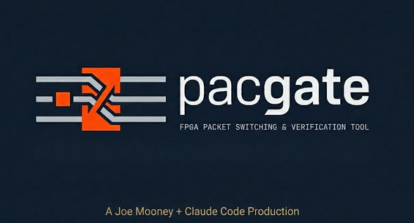
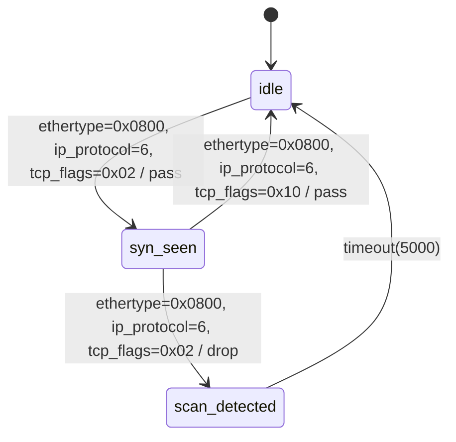

```
                                                           _____
                       ______________ _____________ ______ __  /_____
                       ___  __ \  __ `/  ___/_  __ `/  __ `/  __/  _ \
                       __  /_/ / /_/ // /__ _  /_/ // /_/ // /_ /  __/
                       _  .___/\__,_/ \___/ _\__, / \__,_/ \__/ \___/
                       /_/                  /____/
                       
                       ___Packet Filter Compiler & Verification Gateway___
```

<p align="center">
  
</p>

<p align="center">
  <strong>Define rules in YAML. Generate hardware (Verilog) or software (Rust). Prove correctness in simulation.</strong>
</p>

<p align="center">
  <a href="#quick-start">Quick Start</a> &bull;
  <a href="#how-it-works">How It Works</a> &bull;
  <a href="#examples">Examples</a> &bull;
  <a href="#verification">Verification</a> &bull;
  <a href="docs/user-guide/">User Guide</a> &bull;
  <a href="docs/COMPARISON.md">Comparison</a>
</p>

## Family Reference

For the full cross-product map (PacGate, PaciNet, PaciLab, PaciLearn, PaciView, PacMate), see:
[`PACINET_FAMILY.md`](../pacinet/PACINET_FAMILY.md)

---

<p align="center">
  
</p>

---

## What is PacGate?

PacGate is a **packet filtering compiler** that turns YAML rule definitions into **synthesizable Verilog hardware**, **standalone Rust software filters**, and a **complete verification environment** — all from a single specification.

No other tool generates both the implementation *and* the test harness from the same spec. PacGate guarantees perfect alignment between what you specify, what gets built, and what gets tested — whether deploying to an FPGA or running a software filter on a Linux server.

### One Spec, Five Outputs

```
                    ┌────────────────────────────────┐
                    │         rules.yaml             │
                    │  ┌───────────────────────────┐ │
                    │  │ - allow_arp:              │ │
                    │  │     ethertype: 0x0806     │ │
                    │  │     action: pass          │ │
                    │  │ - block_broadcast:        │ │
                    │  │     dst_mac: ff:ff:...:ff │ │
                    │  │     action: drop          │ │
                    │  └───────────────────────────┘ │
                    └──────────────┬─────────────────┘
                                   │
                          pacgate compile
                                   │
       ┌──────────┬────────────────┼────────────┬──────────────┐
       ▼          ▼                ▼            ▼              ▼
  ┌──────────┐ ┌──────────┐ ┌──────────┐ ┌──────────┐ ┌──────────┐
  │ Verilog  │ │  Rust    │ │  cocotb  │ │   SVA    │ │  P4_16   │
  │   RTL    │ │  Filter  │ │  Tests   │ │ Asserts  │ │   PSA    │
  └──────────┘ └──────────┘ └──────────┘ └──────────┘ └──────────┘
       │            │            │            │             │
       ▼            ▼            ▼            ▼             ▼
  Xilinx FPGA  cargo build  Icarus/Questa  SymbiYosys  Tofino/
  (Artix-7)    → binary     + cocotb       (BMC/cover) SmartNIC
```

## Quick Start

### Install

```bash
# Clone and build
git clone https://github.com/joemooney/pacgate.git
cd pacgate
cargo build --release

# Optional: install to PATH
cargo install --path .
```

### Your First Filter

```bash
# Create a starter rule file
pacgate init my_filter.yaml

# Edit rules (or use an example)
cat rules/examples/enterprise.yaml

# Compile to Verilog + tests
pacgate compile rules/examples/enterprise.yaml -o gen/

# Validate without generating
pacgate validate rules/examples/enterprise.yaml

# See what changed between two rule sets
pacgate diff rules/examples/allow_arp.yaml rules/examples/enterprise.yaml
```

### Software Filter (no FPGA needed)

```bash
# Generate a standalone Rust binary from rules
pacgate compile rules/examples/rust_filter_demo.yaml --target rust -o gen/

# Build and run
cd gen/rust && cargo build --release
./target/release/pacgate_filter input.pcap --output filtered.pcap --stats

# Or simulate without code generation
pacgate simulate rules/examples/enterprise.yaml --packet "ethertype=0x0800,dst_port=80"
```

### Run Hardware Simulation

```bash
# Prerequisites: Python 3, cocotb, and either Icarus Verilog or Questa/QuestaSim
pip install cocotb cocotb-coverage hypothesis

# Compile and simulate with Icarus (default)
make sim RULES=rules/examples/enterprise.yaml

# Compile and simulate with Questa/QuestaSim
make sim RULES=rules/examples/enterprise.yaml SIM=questa

# Run with AXI-Stream wrapper
pacgate compile rules/examples/enterprise.yaml --axi -o gen/
make sim-axi RULES=rules/examples/enterprise.yaml
```

### Web Simulator App

PacGate now includes a separate simulator application with a web UI for driving packet events and inspecting responses.

```bash
# Build pacgate binary
cargo build

# Start simulator app
python3 simulator-app/server.py
```

Open `http://127.0.0.1:8787`.

See [`simulator-app/README.md`](simulator-app/README.md) for details.

### Formal Verification

```bash
# Generate SVA assertions + SymbiYosys tasks
pacgate formal rules/examples/enterprise.yaml -o gen/

# Run bounded model checking (requires SymbiYosys)
cd gen/formal && sby -f packet_filter.sby
```

## How It Works

### Rule Language

PacGate rules are defined in YAML. Each rule specifies match criteria and an action (pass or drop). Rules are evaluated by priority — highest priority match wins.

```yaml
pacgate:
  version: "1.0"
  defaults:
    action: drop          # Whitelist mode: block everything by default

  rules:
    - name: allow_arp
      type: stateless
      priority: 100
      match:
        ethertype: "0x0806"
      action: pass

    - name: allow_mgmt_vlan
      type: stateless
      priority: 90
      match:
        vlan_id: 100
      action: pass

    - name: allow_vendor_cisco
      type: stateless
      priority: 80
      match:
        src_mac: "00:26:cb:*:*:*"   # Wildcard last 3 octets
      action: pass
```

### Match Fields

| Layer | Field | Description | Example |
|-------|-------|------------|---------|
| L2 | `dst_mac` | Destination MAC (exact or wildcard) | `"ff:ff:ff:ff:ff:ff"`, `"01:80:c2:*:*:*"` |
| L2 | `src_mac` | Source MAC (exact or wildcard) | `"00:1a:2b:*:*:*"` |
| L2 | `ethertype` | EtherType (16-bit hex) | `"0x0800"` (IPv4), `"0x0806"` (ARP) |
| L2 | `vlan_id` | VLAN ID (0–4095) | `100` |
| L2 | `vlan_pcp` | VLAN Priority Code Point (0–7) | `7` |
| L2 | `outer_vlan_id` | QinQ outer VLAN ID (0–4095) | `200` |
| L2 | `outer_vlan_pcp` | QinQ outer Priority Code Point (0–7) | `5` |
| L3 | `src_ip` | IPv4 source (exact or CIDR) | `"10.0.0.0/8"` |
| L3 | `dst_ip` | IPv4 destination (exact or CIDR) | `"192.168.1.1"` |
| L3 | `ip_protocol` | IP protocol number (8-bit) | `6` (TCP), `17` (UDP) |
| L3 | `ip_dscp` | IPv4 DSCP (6-bit, 0–63) | `46` (EF) |
| L3 | `ip_ecn` | IPv4 ECN (2-bit, 0–3) | `1` (ECT1) |
| L3 | `ip_ttl` | IPv4 TTL (0–255) | `1` |
| L3 | `ip_dont_fragment` | IPv4 DF flag | `true` |
| L3 | `ip_more_fragments` | IPv4 MF flag | `true` |
| L3 | `ip_frag_offset` | IPv4 fragment offset (13-bit) | `0` |
| L3 | `src_ipv6` | IPv6 source (CIDR prefix) | `"2001:db8::/32"` |
| L3 | `dst_ipv6` | IPv6 destination (CIDR prefix) | `"fe80::/10"` |
| L3 | `ipv6_next_header` | IPv6 next header (8-bit) | `58` (ICMPv6) |
| L3 | `ipv6_dscp` | IPv6 DSCP from Traffic Class (6-bit) | `46` |
| L3 | `ipv6_ecn` | IPv6 ECN from Traffic Class (2-bit) | `0` |
| L3 | `ipv6_hop_limit` | IPv6 hop limit (0–255) | `64` |
| L3 | `ipv6_flow_label` | IPv6 flow label (20-bit) | `12345` |
| L3 | `igmp_type` | IGMP message type (8-bit hex) | `"0x11"` (query) |
| L3 | `mld_type` | MLD message type (8-bit) | `130` (query) |
| L3 | `icmp_type` / `icmp_code` | ICMPv4 type and code (0–255) | `8` (echo request) |
| L3 | `icmpv6_type` / `icmpv6_code` | ICMPv6 type and code (0–255) | `128` (echo request) |
| L3 | `arp_opcode` | ARP opcode (1=request, 2=reply) | `1` |
| L3 | `arp_spa` / `arp_tpa` | ARP sender/target protocol address | `"10.0.0.1"` |
| L4 | `src_port` | TCP/UDP source port (exact or range) | `80` or `{range: [1024, 65535]}` |
| L4 | `dst_port` | TCP/UDP destination port (exact or range) | `443` |
| L4 | `tcp_flags` | TCP flags (8-bit) with optional mask | `0x02` (SYN) |
| L4 | `conntrack_state` | Connection tracking state | `"new"`, `"established"` |
| Tunnel | `vxlan_vni` | VXLAN Network Identifier (24-bit) | `1000` |
| Tunnel | `gtp_teid` | GTP-U Tunnel Endpoint ID (32-bit) | `12345` |
| Tunnel | `geneve_vni` | Geneve VNI (24-bit, RFC 8926) | `1000` |
| Tunnel | `gre_protocol` | GRE protocol type (16-bit) | `0x0800` |
| Tunnel | `gre_key` | GRE key (32-bit, optional) | `42` |
| L2.5 | `mpls_label` | MPLS label (20-bit) | `1000` |
| L2.5 | `mpls_tc` | MPLS Traffic Class (3-bit) | `5` |
| L2.5 | `mpls_bos` | MPLS Bottom of Stack (1-bit) | `1` |
| OAM | `oam_level` | IEEE 802.1ag CFM MD level (0–7) | `3` |
| OAM | `oam_opcode` | CFM OpCode (8-bit) | `1` (CCM) |
| SFC | `nsh_spi` | NSH Service Path Identifier (24-bit) | `100` |
| SFC | `nsh_si` | NSH Service Index (8-bit) | `255` |
| SFC | `nsh_next_protocol` | NSH inner protocol type | `1` (IPv4) |
| Sim | `frame_len_min` / `frame_len_max` | Frame length range (simulation-only) | `64`, `1518` |
| Raw | `byte_match` | Byte-offset match with mask | `{offset: 14, value: "45", mask: "F0"}` |

### Rewrite Actions

Rules can modify packet fields in-flight (requires `--axi` flag):

| Action | Description | Example |
|--------|-------------|---------|
| `set_dst_mac` / `set_src_mac` | MAC rewrite | `"00:11:22:33:44:55"` |
| `set_vlan_id` | Inner VLAN ID rewrite | `200` |
| `set_vlan_pcp` | VLAN Priority Code Point (0–7) | `6` |
| `set_outer_vlan_id` | QinQ outer VLAN ID (0–4095) | `300` |
| `set_ttl` / `dec_ttl` | IPv4 TTL set/decrement | `64` / `true` |
| `set_hop_limit` / `dec_hop_limit` | IPv6 hop limit set/decrement | `64` / `true` |
| `set_src_ip` / `set_dst_ip` | IPv4 address rewrite (NAT) | `"10.0.0.1"` |
| `set_dscp` | DSCP QoS remarking (0–63) | `46` |
| `set_ecn` | ECN marking (0–3) | `3` |
| `set_src_port` / `set_dst_port` | L4 port rewrite (PAT) | `8080` |

### Stateful Rules (FSM)

PacGate supports **stateful sequence detection** using finite state machines with configurable timeouts:

```yaml
- name: arp_then_ipv4
  type: stateful
  priority: 50
  fsm:
    initial_state: idle
    states:
      idle:
        transitions:
          - match:
              ethertype: "0x0806"    # ARP
            next_state: arp_seen
            action: pass
      arp_seen:
        timeout_cycles: 1000         # Return to idle after timeout
        transitions:
          - match:
              ethertype: "0x0800"    # IPv4 after ARP
            next_state: idle
            action: pass
```

### Mermaid FSM Import/Export

PacGate supports bidirectional conversion between Mermaid `stateDiagram-v2` and YAML rules — design your FSM visually, then compile to hardware:

**Mermaid diagram** (`port_scan_detect.md`):

````

````

**Import Mermaid to YAML:**
```bash
pacgate from-mermaid port_scan_detect.md --name port_scan --priority 100
```

**Produces this YAML rule:**
```yaml
- name: port_scan
  type: stateful
  priority: 100
  fsm:
    initial_state: idle
    states:
      idle:
        transitions:
          - match:
              ethertype: "0x0800"
              ip_protocol: 6
              tcp_flags: 2        # SYN
            next_state: syn_seen
            action: pass
      syn_seen:
        timeout_cycles: 5000
        transitions:
          - match:
              ethertype: "0x0800"
              ip_protocol: 6
              tcp_flags: 2        # Another SYN = scan
            next_state: scan_detected
            action: drop
          - match:
              ethertype: "0x0800"
              ip_protocol: 6
              tcp_flags: 16       # ACK = legitimate
            next_state: idle
            action: pass
      scan_detected:
        timeout_cycles: 5000
        transitions: []
```

**Export YAML back to Mermaid:**
```bash
pacgate to-mermaid rules.yaml    # Outputs stateDiagram-v2 to stdout
```

This enables a visual design workflow: sketch the FSM in any Mermaid-compatible editor (GitHub, VS Code, Mermaid Live), import to YAML, compile to hardware.

### Generated Hardware

The compiler generates a pipelined Verilog architecture:

```
AXI-Stream In ──► AXI Adapter ──► Frame Parser ──► Rule Matchers ──► Priority Encoder ──► FIFO ──► AXI-Stream Out
                                       │              (parallel)         (first match)       │
                                       │               ┌─────┐            ┌──────┐           │
                                       └──► fields ──► │ R0  │ ──match──► │      │           │
                                                       │ R1  │ ──match──► │ P.E. │──decision─┘
                                                       │ R2  │ ──match──► │      │
                                                       │ ... │            └──────┘
                                                       └─────┘
```

- **Frame Parser**: Hand-written 22-state FSM, extracts L2/L3/L4/IPv6/VXLAN/GTP-U/Geneve/MPLS/IGMP/MLD/ICMP/ICMPv6/ARP/QinQ/GRE/OAM/NSH fields byte-by-byte
- **Packet Rewrite**: In-place byte substitution engine with RFC 1624 incremental checksum (MAC/VLAN/TTL/IP/DSCP/ECN/hop-limit/PCP/port)
- **Rule Matchers**: Generated per-rule, combinational evaluation in O(1) cycles (stateless) or registered FSM (stateful)
- **Priority Encoder**: Generated if/else chain, highest priority match wins
- **Store-Forward FIFO**: Buffers frames until decision is ready, then forwards or discards
- **AXI-Stream Wrapper**: Standard interface for integration with existing FPGA designs
- **Rate Limiter**: Per-rule token-bucket rate limiting (`--rate-limit`)
- **Connection Tracking**: CRC-based hash table with timeout (`--conntrack`)
- **Runtime Flow Tables**: Register-based match entries with AXI-Lite CRUD + atomic commit (`--dynamic`)
- **Rule Counters**: Per-rule 64-bit packet/byte counters with AXI-Lite readout (`--counters`)

## Examples

PacGate ships with 53 production-quality YAML examples (+ 2 P4, 2 Wireshark, 2 iptables) covering real-world deployment scenarios:

| Example | Scenario | Rules |
|---------|----------|-------|
| [`allow_arp.yaml`](rules/examples/allow_arp.yaml) | Minimal — allow ARP only | 1 |
| [`enterprise.yaml`](rules/examples/enterprise.yaml) | Enterprise campus network | 7 |
| [`blacklist.yaml`](rules/examples/blacklist.yaml) | Threat blocking | 5 |
| [`datacenter.yaml`](rules/examples/datacenter.yaml) | Multi-tenant data center | 8 |
| [`stateful_sequence.yaml`](rules/examples/stateful_sequence.yaml) | Stateful sequence detection (FSM) | 2 |
| [`industrial_ot.yaml`](rules/examples/industrial_ot.yaml) | Industrial OT/SCADA boundary | 8 |
| [`automotive_gateway.yaml`](rules/examples/automotive_gateway.yaml) | Automotive Ethernet gateway | 7 |
| [`5g_fronthaul.yaml`](rules/examples/5g_fronthaul.yaml) | 5G fronthaul filtering | 7 |
| [`campus_access.yaml`](rules/examples/campus_access.yaml) | Campus access control | 8 |
| [`iot_gateway.yaml`](rules/examples/iot_gateway.yaml) | IoT edge gateway | 7 |
| [`syn_flood_detect.yaml`](rules/examples/syn_flood_detect.yaml) | SYN flood detection (stateful) | 3 |
| [`arp_spoof_detect.yaml`](rules/examples/arp_spoof_detect.yaml) | ARP spoofing detection (stateful) | 3 |
| [`l3l4_firewall.yaml`](rules/examples/l3l4_firewall.yaml) | L3/L4 firewall (SSH, HTTP/S, DNS) | 7 |
| [`byte_match.yaml`](rules/examples/byte_match.yaml) | Raw byte-offset matching | 3 |
| [`hsm_conntrack.yaml`](rules/examples/hsm_conntrack.yaml) | Hierarchical FSM + connection tracking | 3 |
| [`ipv6_firewall.yaml`](rules/examples/ipv6_firewall.yaml) | IPv6 firewall (ICMPv6, CIDR) | 6 |
| [`rate_limited.yaml`](rules/examples/rate_limited.yaml) | Rate-limited rules (token-bucket) | 5 |
| [`vxlan_datacenter.yaml`](rules/examples/vxlan_datacenter.yaml) | VXLAN datacenter (VNI isolation) | 6 |
| [`gtp_5g.yaml`](rules/examples/gtp_5g.yaml) | GTP-U 5G mobile core (TEID) | 5 |
| [`mpls_network.yaml`](rules/examples/mpls_network.yaml) | MPLS provider network (label stack) | 5 |
| [`multicast.yaml`](rules/examples/multicast.yaml) | IGMP/MLD multicast filtering | 5 |
| [`dynamic_firewall.yaml`](rules/examples/dynamic_firewall.yaml) | Runtime-updateable flow table (`--dynamic`) | 5 |
| [`qos_classification.yaml`](rules/examples/qos_classification.yaml) | DSCP/ECN QoS classification | 7 |
| [`rewrite_actions.yaml`](rules/examples/rewrite_actions.yaml) | Packet rewrite (MAC/IP/TTL/DSCP) | 5 |
| [`tcp_flags_icmp.yaml`](rules/examples/tcp_flags_icmp.yaml) | TCP SYN/Xmas/ICMP detection | 7 |
| [`arp_security.yaml`](rules/examples/arp_security.yaml) | ARP security (opcode/spa/tpa) | 5 |
| [`icmpv6_firewall.yaml`](rules/examples/icmpv6_firewall.yaml) | ICMPv6 NDP/echo filtering | 5 |
| [`qinq_provider.yaml`](rules/examples/qinq_provider.yaml) | QinQ (802.1ad) provider edge | 5 |
| [`fragment_security.yaml`](rules/examples/fragment_security.yaml) | IPv4 fragmentation attack detection | 5 |
| [`port_rewrite.yaml`](rules/examples/port_rewrite.yaml) | L4 port rewrite (PAT/port forwarding) | 5 |
| [`gre_tunnel.yaml`](rules/examples/gre_tunnel.yaml) | GRE tunnel matching (IP proto 47) | 5 |
| [`conntrack_firewall.yaml`](rules/examples/conntrack_firewall.yaml) | Stateful connection tracking firewall | 5 |
| [`mirror_redirect.yaml`](rules/examples/mirror_redirect.yaml) | Mirror/redirect egress actions | 5 |
| [`flow_counters.yaml`](rules/examples/flow_counters.yaml) | Per-flow packet/byte counters | 5 |
| [`oam_monitoring.yaml`](rules/examples/oam_monitoring.yaml) | IEEE 802.1ag OAM/CFM monitoring | 5 |
| [`nsh_sfc.yaml`](rules/examples/nsh_sfc.yaml) | NSH/SFC service function chaining (RFC 8300) | 5 |
| [`geneve_datacenter.yaml`](rules/examples/geneve_datacenter.yaml) | Geneve cloud overlay (RFC 8926) | 5 |
| [`ttl_security.yaml`](rules/examples/ttl_security.yaml) | TTL-based security + runt frame detection | 5 |
| [`ipv6_routing.yaml`](rules/examples/ipv6_routing.yaml) | IPv6 routing (hop limit + ECN rewrite) | 5 |
| [`qos_rewrite.yaml`](rules/examples/qos_rewrite.yaml) | VLAN PCP remarking + QinQ outer tag rewrite | 5 |
| [`opennic_l3l4.yaml`](rules/examples/opennic_l3l4.yaml) | OpenNIC Shell platform target | 5 |
| [`corundum_datacenter.yaml`](rules/examples/corundum_datacenter.yaml) | Corundum NIC platform target | 5 |
| [`wide_axi_firewall.yaml`](rules/examples/wide_axi_firewall.yaml) | Wide AXI-Stream data path | 5 |
| [`p4_export_demo.yaml`](rules/examples/p4_export_demo.yaml) | P4 export demonstration | 5 |
| [`pipeline_classify.yaml`](rules/examples/pipeline_classify.yaml) | Multi-table pipeline | 5 |
| [`ptp_boundary_clock.yaml`](rules/examples/ptp_boundary_clock.yaml) | PTP boundary clock (IEEE 1588) | 5 |
| [`ptp_5g_fronthaul.yaml`](rules/examples/ptp_5g_fronthaul.yaml) | PTP 5G fronthaul | 5 |
| [`rss_datacenter.yaml`](rules/examples/rss_datacenter.yaml) | RSS multi-queue dispatch | 5 |
| [`rss_nic_offload.yaml`](rules/examples/rss_nic_offload.yaml) | RSS NIC offload | 5 |
| [`int_datacenter.yaml`](rules/examples/int_datacenter.yaml) | INT network telemetry | 5 |
| [`pcap_gen_demo.yaml`](rules/examples/pcap_gen_demo.yaml) | Synthetic PCAP generation | 5 |
| [`optimize_demo.yaml`](rules/examples/optimize_demo.yaml) | Rule set optimizer demo | 5 |
| [`rust_filter_demo.yaml`](rules/examples/rust_filter_demo.yaml) | **Rust software filter** | 6 |

### Try an Example

```bash
# Compile the industrial OT example
pacgate compile rules/examples/industrial_ot.yaml -o gen/

# See resource estimates for automotive gateway
pacgate estimate rules/examples/automotive_gateway.yaml

# Compare two configurations
pacgate diff rules/examples/enterprise.yaml rules/examples/datacenter.yaml

# Visualize rule set as a graph
pacgate graph rules/examples/campus_access.yaml | dot -Tpng -o campus.png

# Get analytics on a rule set
pacgate stats rules/examples/5g_fronthaul.yaml
```

## CLI Reference

```
USAGE: pacgate <COMMAND>

COMMANDS:
  compile        Generate Verilog RTL + cocotb test bench from YAML rules
  validate       Validate YAML rules without generating output
  init           Create a starter rules file with comments
  estimate       FPGA resource estimation (LUTs/FFs) + timing analysis
  diff           Compare two rule sets (added/removed/modified rules)
  graph          Output DOT graph of rule set for Graphviz
  stats          Rule set analytics (field usage, priority spacing)
  formal         Generate SVA assertions + SymbiYosys task files
  lint           Best-practice analysis (57 rules: security, performance, prerequisites)
  report         Generate HTML coverage report
  pcap           Import PCAP capture for cocotb test stimulus
  pcap-analyze   Analyze PCAP traffic + auto-suggest rules
  pcap-filter    Filter PCAP through rules (pass/drop split, per-rule stats)
  simulate       Software dry-run simulation (no hardware needed)
  synth          Generate Yosys/Vivado synthesis project files
  mutate         Mutation testing (41 strategies + kill-rate runner)
  mcy            MCY (Mutation Cover with Yosys) config generation
  template       Built-in rule templates (list/show/apply)
  doc            Generate styled HTML rule documentation
  bench          Benchmark compile time, sim throughput, LUT/FF scaling
  from-mermaid   Import Mermaid stateDiagram to YAML rules
  to-mermaid     Export YAML FSM rules to Mermaid stateDiagram-v2
  reachability   Analyze rule reachability (shadowed, redundant rules)
  scenario       Validate, import/export scenario JSON files
  regress        High-volume packet regression against scenarios
  topology       Multi-port topology simulation
  p4-export      Generate P4_16 PSA program from YAML rules
  p4-import      Import P4_16 PSA program → YAML rules
  wireshark-import  Convert Wireshark display filter to YAML rules
  iptables-import   Convert iptables-save output to YAML rules
  optimize       Rule set optimizer (dead rule, dedup, port/CIDR consolidation)
  pcap-gen       Generate synthetic PCAP traffic from rules
  completions    Generate shell completions (bash/zsh/fish)

COMPILE FLAGS:
  --axi          Include AXI-Stream wrapper + store-forward FIFO + rewrite engine
  --counters     Include per-rule 64-bit packet/byte counters + AXI-Lite CSR
  --ports N      Generate multi-port switch fabric (N parallel filters)
  --conntrack    Include connection tracking hash table RTL (TCP state machine)
  --rate-limit   Include per-rule token-bucket rate limiter RTL
  --dynamic      Runtime-updateable flow table (AXI-Lite writable, replaces static matchers)
  --dynamic-entries N  Max flow table entries (1-256, default 16)
  --target T     Platform target: opennic, corundum, or rust (software filter)
  --width W      AXI-Stream data path width: 8/64/128/256/512/1024/2048
  --ptp          Include IEEE 1588 PTP hardware timestamping clock
  --rss          Enable RSS multi-queue dispatch (Toeplitz hash)
  --rss-queues N RSS queue count (default 4, max 16)
  --int          Enable INT sideband metadata output
  --int-switch-id N  INT switch identifier

SIMULATE FLAGS:
  --stateful     Enable rate-limit + connection tracking in software simulation
  --pcap-out F   Write simulation results to Wireshark-compatible PCAP file

GLOBAL FLAGS:
  --json         Machine-readable JSON output (most commands)
  -o <DIR>       Output directory (default: gen/)
```

## Verification

PacGate generates a comprehensive verification environment inspired by UVM methodology:

### Simulation (cocotb)
- **Directed tests**: Per-rule frames with proper protocol headers for 20+ protocols (Geneve, GRE, OAM, NSH, ARP, ICMP, ICMPv6, QinQ, TCP flags, DSCP/ECN, IPv6 TC, and more)
- **Random tests**: 500+ constrained-random frames with full-stack scoreboard checking (L2 through tunnel fields)
- **Corner cases**: Runt frames, jumbo frames, back-to-back, broadcast MAC, VLAN PCP extremes, reset recovery
- **Property tests**: 17 Hypothesis-based strategies including GTP-U, MPLS, IGMP, MLD, GRE, OAM, NSH, ARP, ICMP, ICMPv6, QinQ, TCP flags
- **Coverage**: Functional coverage with cover points, bins, cross coverage, XML export, coverage-directed closure
- **Boundary tests**: Auto-derived CIDR boundary and port boundary test cases
- **Mutation testing**: YAML-level (33 strategies + kill-rate runner) and Verilog-level (MCY)
- **Software simulation**: `simulate` command for dry-run testing without hardware toolchain

### Formal Verification (SymbiYosys)
- **SVA assertions** generated from rules: reset correctness, completeness, latency bounds, protocol prerequisites
- **Bounded model checking**: Mathematical proof that rules behave correctly
- **Cover mode**: Verify all rules and protocol paths are reachable
- **Protocol assertions**: GTP-U/MPLS/IGMP/MLD/GRE/OAM/NSH/Geneve prerequisite and bounds checking

### Results
```
Enterprise example (7 rules):
  13 cocotb tests ................ PASS
  500 random packets ............. 0 mismatches
  Functional coverage ............ 85%+
  Property tests (500 frames) ... 500/500 PASS
  Formal (BMC depth 20) ......... PROVEN
```

## FPGA Targeting

```bash
# Resource estimation
$ pacgate estimate rules/examples/enterprise.yaml

  ┌─────────────────────────────────────────┐
  │     FPGA Resource Estimate (Artix-7)    │
  ├─────────────────┬───────┬───────────────┤
  │ Component       │ LUTs  │ Flip-Flops    │
  ├─────────────────┼───────┼───────────────┤
  │ Frame parser    │ ~120  │ ~80           │
  │ 7 rule matchers │ ~280  │ ~0            │
  │ Decision logic  │ ~35   │ ~2            │
  │ Total           │ ~435  │ ~82           │
  │ Artix-7 usage   │ 2.1%  │ 0.2%          │
  └─────────────────┴───────┴───────────────┘

  Pipeline: 16 cycles @ 125 MHz = 128 ns latency
```

### Synthesis with Yosys

```bash
# Open-source synthesis targeting Xilinx 7-series
make synth RULES=rules/examples/enterprise.yaml
```

## Project Structure

```
pacgate/
├── src/                    # Rust compiler (41 subcommands)
│   ├── main.rs             # CLI (clap) — 57 lint rules, 57 match fields
│   ├── model.rs            # Data model (L2/L3/L4/IPv6/tunnel/OAM/SFC/rewrite/HSM)
│   ├── loader.rs           # YAML loader + validation + CIDR/port overlap detection
│   ├── verilog_gen.rs      # Tera-based Verilog generation (all match fields + multi-port)
│   ├── rust_gen.rs         # Rust software filter code generation (--target rust)
│   ├── p4_gen.rs           # P4_16 PSA code generation (p4-export)
│   ├── p4_import.rs        # P4_16 import: reverse field mapping (p4-import)
│   ├── wireshark_import.rs # Wireshark display filter import (wireshark-import)
│   ├── iptables_import.rs  # iptables-save import (iptables-import)
│   ├── optimize.rs         # Rule set optimizer: 5 optimization passes
│   ├── cocotb_gen.rs       # cocotb test harness + property test generation
│   ├── formal_gen.rs       # SVA assertion + SymbiYosys generation
│   ├── simulator.rs        # Software simulation (stateless + stateful rate-limit/conntrack)
│   ├── pcap_analyze.rs     # PCAP traffic analysis + rule suggestion engine
│   ├── pcap_gen.rs         # Synthetic PCAP traffic generation
│   ├── synth_gen.rs        # Yosys/Vivado synthesis project generation
│   ├── mutation.rs         # Rule mutation engine (41 strategies)
│   ├── mcy_gen.rs          # MCY Verilog-level mutation config generation
│   ├── benchmark.rs        # Performance benchmarking engine
│   ├── scenario.rs         # Scenario validation, regression testing, topology simulation
│   └── ...                 # mermaid, pcap, templates_lib, pcap_writer
├── templates/              # 44 Tera templates (Verilog, Rust, cocotb, SVA, P4, HTML, synthesis, platforms)
├── rtl/                    # Hand-written Verilog (parser, rewrite, AXI, FIFO, counters, conntrack, rate limiter, width converters)
├── rules/examples/         # 53 YAML rule examples (+ 2 P4, 2 Wireshark, 2 iptables)
├── rules/templates/        # 7 built-in rule templates
├── verification/           # Python verification framework (scoreboard, coverage, properties, driver, packet factory)
├── synth/                  # Synthesis files (XDC constraints, Yosys script)
├── tests/                  # 428 Rust integration tests
├── gen/                    # Generated output directory
└── docs/                   # Full documentation suite
```

## Quality

| Metric | Value |
|--------|-------|
| Rust unit tests | 726 |
| Rust integration tests | 428 |
| Python scoreboard tests | 90 |
| cocotb simulation tests | 13+ directed + 5 conntrack |
| Random packet scoreboard | 500/500 matches |
| Functional coverage | 85%+ |
| Hypothesis property tests | 17 strategies (L3/L4, GTP-U, MPLS, IGMP, MLD, GRE, OAM, NSH, ARP, ICMP, ICMPv6, QinQ, TCP flags) |
| SVA formal assertions | 30+ properties (protocol prerequisites, bounds, cover) |
| Lint rules | 57 (LINT001-057) |
| Mutation strategies | 41 YAML-level + MCY Verilog-level |
| Match fields | 57 (L2/L3/L4/IPv6/tunnel/OAM/SFC/QoS/fragmentation/PTP/RSS/INT) |
| Rewrite actions | 15 (MAC/VLAN/TTL/IP/DSCP/ECN/hop-limit/PCP/port) |
| Rule overlap detection | Compile-time CIDR/port range analysis |
| YAML examples | 53 production-quality (+ 2 P4, 2 Wireshark, 2 iptables) |
| Output targets | 5 (Verilog, Rust software, P4, OpenNIC, Corundum) |
| CLI subcommands | 41 |
| Import formats | 4 (YAML, P4, Wireshark, iptables) |

## Technology Stack

- **Compiler**: Rust (clap, serde_yaml, serde_json, tera)
- **HDL**: Verilog (IEEE 1364-2005 compatible)
- **Software target**: Rust (standalone binary, PCAP I/O, optional AF_XDP)
- **P4 target**: P4_16 PSA (Tofino, SmartNIC)
- **Simulation**: cocotb 2.x with Icarus Verilog (open-source), Questa/QuestaSim (Siemens), VCS (Synopsys), or Xcelium (Cadence)
- **Verification**: UVM-inspired Python framework
- **Formal**: SymbiYosys + SMT solvers
- **Property Testing**: Hypothesis (Python)
- **Synthesis**: Yosys (open-source) targeting Xilinx 7-series
- **Target FPGA**: Xilinx Artix-7 (XC7A35T)
- **Import formats**: YAML, P4_16, Wireshark display filters, iptables-save

## License

Proprietary. All rights reserved. See [LICENSE](LICENSE) for details.

---

<p align="center">
  <em>PacGate — Where rules become hardware or software, and tests prove it works.</em>
</p>
